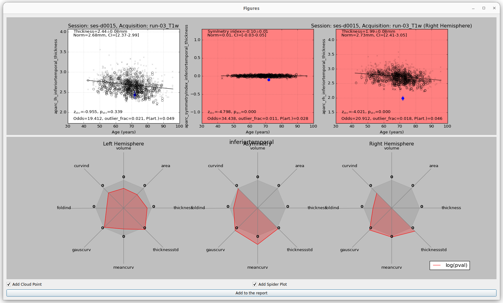

# ScanOMetrics

Welcome to the ScanOMetrics repository !

About
=====
ScanOMetrics is an open-source software for normative modeling from MRI scans. Our tool currently provides a GUI for basic MRI
processing, statistical evaluation against a reference population, and visualization of results with 3D surface rendering as well
as detailed cloudpoints and metric spyder plots.

Documentation
=============

For installation and usage of the ScanOMetrics package, check our [documentation](https://scanometrics.readthedocs.io/en/latest/)

How to cite
===========

When publishing work related to ScanOMetrics, please cite the following article:

>     Rummel C, Aschwanden F, McKinley R, Wagner F, Salmen A, Chan A, Wiest R.
>     A Fully Automated Pipeline for Normative Atrophy in Patients with Neurodegenerative Disease.
>     Front Neurol. 8:727 (2018).
>     https://doi.org/10.3389/fneur.2017.00727

Cited by
========

ScanOMetrics has been used in the following studies:

>     Romascano D, Rebsamen  M, Radojewski P, Blattner T, McKinley R, Wiest R, Rummel C
>     Cortical thickness and grey-matter volume anomaly detection in individual MRI scans: Comparison of two methods.
>     NeuroImage: Clinical, 43, p.103624 (2024)
>     https://doi.org/10.1016/j.nicl.2024.103624

>     Rebsamen M, Suter Y, Wiest R, Reyes M, Rummel C.
>     Brain morphometry estimation: From hours to seconds using deep learning.
>     Frontiers in neurology, 11:244 (2020)
>     https://doi.org/10.3390/brainsci13091270

>     Rummel C, Slavova N, Seiler A, Abela E, Hauf M, Burren Y, Weisstanner C, Vulliemoz S, Seeck M, Schindler K, Wiest R
>     Personalized structural image  analysis in patients with temporal lobe epilepsy.
>     Sci Rep 7, 10883 (2017).
>     https://doi.org/10.1038/s41598-017-10707-1

