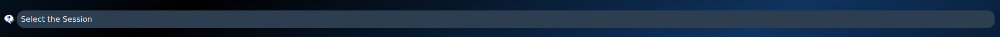

Graphical User Interface (GUI)
==============================

Our GUI consists of a `Main window`_ for model and scan selection, and a `Visualization window`_ for scan processing and evaluation

Main window
-----------

  Figure 1: ScanOMetrics GUI's main window

The figure above shows ScanOMetrics GUI's main window. Follow instructions below to process and evaluate new scans:

Select BIDS folder
******************

.. _selectBIDS:

  Figure 2: BIDS folder selection

The first step involves selecting the path to the BIDS folder containing the scan of interest. Click on the Search button,
navigate your filesystem, select the BIDS folder and click on "Choose".

Select normative model
**********************

.. _selectModel:
.. figure:: ../figures/gui/select_model.png
  :scale: 50 %
  :alt: Normative model selection widget

  Figure 3: Normative model selection

You then have to select which normative model you want to use. Click on the "Select your normative model (.pkl)" dropdown menu.
Model names have a `<normativeModel>_<processingToolName>_<processingToolVersion>_<atlas>_<dataset>_<SOMversion>` format
where

  * `normativeModel`: describes the model used to describe metrics as a function of age. All models are currently polynomial models, but GAMLSS models will be available in the future.
  * `processingToolName`: name of the morphometry tool used to process MRI scans. Currently `dldirect` and `freesurfer` are supported. If you intend to process data, make sure to have the tool installed on your system. If you already have processed data and only want to evaluate it, make sure to place the processing outputs in the appropriate BIDS derivatives folder.
  * `processingToolVersion`: version of the processing tool. We currently distribute models for DL+DiReCT version 1.0.3 and FreeSurfer 6.0.0, but newer version will be available in the future.
  * `atlas`: name of the atlas used for segmentation. The `DesikanKilliany` and `Destrieux` atlases are currently available, for both DL+DiReCT and FreeSurfer. Both atlases use the same set of subcortical regions.
  * `dataset`: name of the normative dataset the model was trained on. We currently distribute models trained on the OASIS3 dataset.
  * `SOMversion`: ScanOMetrics version used to train the model. You should install the same version on your system to ensure data processing and evaluation matches the normative model.

The `Polynomial_dldirect_v1-0-3_DesikanKilliany_OASIS3_som-v0-1-0.pkl` model for example corresponds to a polynomial model fit to
morphometry features estimated using DL+DiReCT v1.0.3 and the DesikanKilliany atlas, on the OASIS3 normative dataset and ScanOMetrics v0.1.0.

When selecting a model, ScanOMetrics checks if the pkl file is available on your system. If it's not, the file is downloaded from our
Zenodo repository. Normative models are stored in the folder where you downloaded ScanOMetrics' source code, in `scanometrics/resources/normative_models`.
For example, if you downloaded ScanOMetrics to `/home/user/Software/scanometrics`, normative model files will be stored in `/home/user/Software/scanometrics/scanometrics/resources/normative_models`.
You can add your own normative pkl files to the folder for them to appear in the dropdown menu.

Select subject
**************

.. _selectSubject:

  Figure 4: Dropdown menu for subject selection

To select a subject, click on the "Select the Subject" dropdown menu. The list of subjects in the BIDS participants.tsv file will appear.
Select the subject by clicking on the ID of interest.

Select session
**************

.. _selectSession:

  Figure 4: Dropdown menu for session selection

The "Select the Session" dropdown menu displays the different BIDS sessions available for the selected subject. Click on the one you'd like to analyse.

Select acquisition
******************

.. _selectAcquisition:

  Figure 5: Dropdown menu for selection of acquisition scan

Finally, the "Select acquisition label" dropdown menu displays the scans available in the selected session. Click on the one you'd like to analyse.

Go to visualization window
**************************

Click on the arrow at the bottom of the screen to move to the visualization window.

Visualization window
--------------------

  Figure 6: ScanOMetrics GUI's visualization window

The visualization window allows to `run the processing pipeline <Run processing pipeline>`_, `visualize metric evaluation results <Visualizing evaluation results>`_,
`select relevant information <Selecting relevant information>`_ for scan reports, and `generate said reports <Generating report>`_.

If the scan has not been processed yet, FreeSurfer's fsaverage surface will be displayed on the right side of the window.

Run processing pipeline
***********************

  Figure 7: Button to run scan processing pipeline

To process the selected scan, click on the "Run Processing Pipeline" on the bottom left corner. This will launch the pipeline
corresponding to the normative model that was selected in the `Main window`_.

Visualizing evaluation results
******************************

  Figure 8: Thickness evaluation results

The right side of the window displays the reconstructed surface for the two hemispheres. Evaluated metrics can be selected
using the checkboxes above the surface rendering windows (volume, thickness and standard deviation of the thickness are
currently available). When selecting a metric, cortical regions with significant deviation from normative ranges are
highlighted in red-yellow (higher than expected) and blue-light blue (lower than expected). Color intensity is proportional
to log(p) values.

.. figure:: ../figures/gui/region_results.png
  :scale: 30 %
  :alt: Region result window

  Figure 9: Region detailed results

Detailed results can be viewed by clicking on a region of interest. This opens a ROI window, that displays cloud points on the upper
half, and spider plots on the lower half. The point clouds represent scan values and normative data for the region
of interest, with the left and right hemisphere on either side, and the symmetry index in between. Values from normative
scans matching for sex and sequence are displayed with non-transparent symbols. The mean of the normative curve is plotted
as a function of age. The value obtained for the scan of interest is displayed with a blue circle. Further details as
odds for artifacts and z-scores are displayed as text on the figures.

The lower part of the ROI window diplays spider plots summarizing the ROI's log(p) values across metrics. FreeSurfer metrics
currently include volume, area, thickness, standard deviation of the thickness, mean curvature, gaussian curvature, folding index,
and curvature index. DL+DiReCT on the other side

Selecting relevant information
******************************
Screenshots of surface renderings can be added to the scan report by clicking on the "Capture the brain" button at the
bottom of the 3D rendering.

Detailed regional results can be added by clicking on the "Add to the report" button at the bottom of the ROI windows.

Generating report
*****************

An automated report can be generated by clicking on the "Generate Report" at the bottom left corner. This will save
a PDF report in the `<bids_directory>/ScanOMetrics_report/<subject_id>/<session_id>/<acquisition_label>` folder.
